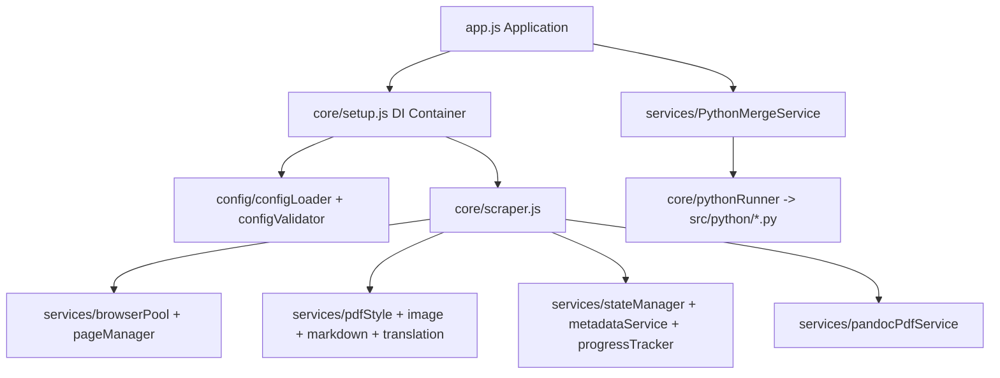

# Documentation PDF Scraper 项目全量梳理与设计评审（2026-02-11）

## 1. 审阅范围与方法

### 1.1 审阅范围
- 代码结构：`src/app.js`、`src/core/*`、`src/services/*`、`src/config/*`、`src/utils/*`
- 配置与脚本：`config.json`、`doc-targets/*`、`config-profiles/*`、`scripts/*`、`Makefile`
- 质量体系：`tests/*`、`jest.config.js`、`eslint.config.js`、`package.json`、`.github/workflows/ci.yml`

### 1.2 验证基线（本次审阅现场执行）
- `npm test`：**27 suites / 612 tests 全通过**
- `npm run lint`：**通过**

> 结论：当前主干可运行，质量门禁基本有效；但在配置治理、可维护性和规模化稳定性上有改进空间。

## 2. 项目定位与核心能力

该项目是一个面向文档站点的 PDF 抓取与生成系统，核心能力包括：
- 基于 Puppeteer 的页面抓取与反爬绕过（stealth）
- 内容展开（可折叠区域、样式处理、图片懒加载）
- DOM/Markdown 到 PDF 的双路径生成（Puppeteer 或 Pandoc）
- Python（PyMuPDF）后处理合并与目录书签
- 多文档目标（doc-target）与 Kindle 配置档切换

## 3. 架构全景

### 3.1 模块职责划分
- `app.js`：生命周期编排（初始化、抓取、合并、关闭）
- `core/setup.js`：依赖注入、服务装配、健康检查
- `core/scraper.js`：抓取主流程（URL 收集、队列执行、重试、状态落盘）
- `services/*`：按领域拆分（浏览器、页面、状态、元数据、翻译、Markdown、PDF）
- `config/*`：配置加载、合并、校验、运行时解析
- `python/*`：PDF 合并与书签处理

### 3.2 关键流程（入口到产物）
1. `Application.run()` 初始化容器与环境检查
2. `Scraper.run()` 收集 URL，按队列并发抓取页面
3. 页面处理链：导航 -> 图片处理 -> 样式处理 -> 内容提取/翻译 -> 生成单页 PDF/Markdown
4. 汇总阶段：失败重试、状态保存、标题元数据输出
5. 终态产物：
   - 路径 A：Pandoc 批量生成 PDF
   - 路径 B：Python(PyMuPDF) 合并 PDF + 目录

## 4. 与最佳实践/设计原则对齐情况

### 4.1 做得好的部分
- **依赖注入（DIP）**：服务注册清晰，便于替换实现与测试隔离
- **单一职责（SRP）**：大部分服务按领域切分，边界较明确
- **防御式配置治理**：Joi schema + 默认值 + `stripUnknown`，降低脏配置扩散
- **可观测性基础较好**：日志、进度与状态管理齐全
- **测试网格完整**：`core/services/config/utils` 覆盖较全

### 4.2 仍存在的原则偏差
- **配置单一事实源被削弱**：旧版 loader/schema 与新版并存，存在双轨定义风险
- **运行配置幂等性不足**：Kindle 脚本会直接写回 `config.json`，容易污染后续流程
- **可扩展质量门禁不均衡**：lint 只覆盖 `src`，未覆盖 `tests/scripts`
- **集成级验证不足**：多数测试偏单元，缺少端到端协作链路验证

## 5. 不合理点与修改建议（按优先级）

## P1（建议优先处理）

### 问题 1：队列任务索引可能长期累积，影响长任务内存稳定性
- 位置：`src/services/queueManager.js`
- 影响：URL 数量大时，任务元数据不清理会造成内存随任务量上升
- 建议：
  - 任务完成/失败后从 `tasks` map 移除，或仅保留固定窗口（例如最近 N 条）
  - `getTaskDetails` 仅提供活跃任务 + 最近历史快照
- 验收标准：连续抓取 1000+ URL 时内存曲线稳定，无线性增长

### 问题 2：Kindle 配置脚本改写 `config.json`，存在配置残留污染
- 位置：`scripts/use-kindle-config.js`、`Makefile`
- 影响：执行 `make kindle-*` 后若未 reset，后续 `make run` 可能用到错误配置
- 建议：
  - 方案 A：脚本改为“临时合并+一次性运行”，不落盘主配置
  - 方案 B：在 kindle 目标结束后自动 `reset` 或恢复基线 doc-target
- 验收标准：任意 Kindle 任务执行后，`config.json` 与执行前一致（可比对 hash）

### 问题 3：配置加载器/Schema 双套并存，增加认知与维护负担
- 位置：`src/config/loader.js`、`src/config/schema.js` 与 `src/config/configLoader.js`、`src/config/configValidator.js`
- 影响：新成员容易误用旧入口，字段默认值可能出现不一致
- 建议：
  - 删除废弃实现或显式标记 deprecated
  - 所有脚本统一走同一套 loader + validator
- 验收标准：仓库仅保留一套生效配置入口，文档与代码一致

### 问题 4：doc-target 中存在 Puppeteer 不支持的选择器语法
- 位置：`doc-targets/cloudflare-blog.json`（`a:contains("Older Posts")`）
- 影响：运行时 `querySelector` 可能报错导致分页失败
- 建议：
  - 改为标准 CSS 选择器 + 文本过滤逻辑（在 JS 内按 textContent 判断）
  - 在 CI 增加 selector 合法性校验脚本
- 验收标准：所有 doc-target 选择器均可通过校验脚本，分页链路可复现通过

## P2（中期优化）

### 问题 5：翻译缓存使用同步文件 I/O，影响并发吞吐
- 位置：`src/services/translationService.js`
- 影响：高并发翻译时阻塞事件循环，拉低整体速度
- 建议：切换为 `fs.promises` + 批量/节流写入策略
- 验收标准：并发翻译场景下吞吐提升，事件循环阻塞显著降低

### 问题 6：质量门禁覆盖面不足
- 位置：`package.json`、`.github/workflows/ci.yml`
- 影响：`tests/scripts` 目录风格问题不会被 lint 捕获
- 建议：
  - 扩展 lint 范围至 `tests/**/*.js`、`scripts/**/*.js`
  - CI 增加 `format:check`
- 验收标准：CI 对 src/tests/scripts 的静态检查一致生效

### 问题 7：CI 依赖外部实时网络，稳定性受第三方波动影响
- 位置：`scripts/verify-openclaw-target-coverage.js`、`make ci`
- 影响：非代码问题导致 CI 偶发失败
- 建议：
  - 对关键远端输入做快照或可选离线模式
  - 网络校验拆为“阻断级”和“信息级”两层
- 验收标准：网络抖动时主 CI 仍可稳定反映代码质量

### 问题 8：端到端协作测试偏少
- 位置：`tests/app.test.js` 等
- 影响：单元都通过但跨服务协作仍可能回归
- 建议：增加最小化 E2E 集成测试（容器+抓取+生成+合并的 happy path）
- 验收标准：新增集成测试可捕获 DI 与流程编排回归

## 6. 改进路线图（建议）

### 0-2 周（止血与一致性）
1. 修复 `queueManager` 任务清理机制
2. 修复 `cloudflare-blog` 非法 selector
3. 为 Kindle 工作流加自动恢复基线
4. 统一配置入口，标记/移除旧 loader/schema

### 2-4 周（质量门禁补齐）
1. 扩展 lint/format 检查范围并接入 CI
2. 增加配置/selector 静态校验脚本
3. 为 Jest 增加覆盖率阈值（按核心模块分层）

### 1-2 月（规模化与工程化）
1. 引入最小 E2E 回归集
2. 翻译缓存异步化与性能基准
3. 将网络依赖校验拆级，提升 CI 稳定性

## 7. 建议新增的工程规则（可落地）
- 配置新增必须遵守：**先 schema，后配置文件**（防 `stripUnknown` 静默丢失）
- 每新增 doc-target，必须执行：
  - 选择器合法性校验
  - `scripts/test-config-loading.js`
  - 一次最小抓取 smoke test
- 对外部资源依赖的 CI 步骤，默认应提供 fallback（快照/重试/降级模式）

## 8. 总结

项目整体架构成熟度较高，核心流程完整，测试基础扎实，已具备生产可用特征。当前主要问题不在“能不能跑”，而在“规模化长期维护”的工程细节：配置治理一致性、流程幂等性、质量门禁完整度与端到端回归能力。按本文的 P1/P2 清单执行后，系统在可维护性与稳定性上会有明显提升。

## 9. 本轮实施结果（2026-02-11）

### 9.1 已完成的 P1 项
1. `QueueManager` 任务清理与历史上限
   - 活跃任务与历史任务分离，任务完成后从活跃集合移除
   - 增加有上限历史（`maxTaskHistory`，默认 100）避免长期运行内存线性增长
2. Kindle 生成流程配置污染修复
   - `Makefile` 的 `kindle7`/`kindle-paperwhite`/`kindle-oasis`/`kindle-scribe` 目标引入临时备份 + `trap` 自动恢复 `config.json`
3. 配置入口双轨治理
   - `src/config/loader.js` 改为统一 `configLoader.js` 的兼容桥接导出
   - `src/config/schema.js` 改为统一导出 `configValidator.js` 中的 `configSchema`
4. Cloudflare 选择器兼容性修复
   - 移除不受 Puppeteer 支持的 `:contains(...)` 选择器

### 9.2 新增回归测试
- `tests/services/queueManager.test.js`
  - 验证任务完成后活跃集合清理
  - 验证历史上限淘汰最旧记录
- `tests/config/docTargets.test.js`
  - 验证 `doc-targets/*.json` 不包含 `:contains(...)` 伪类
- `tests/config/legacyConfigCompatibility.test.js`
  - 验证旧配置入口与新配置实现保持一致

### 9.3 验证结果
- `npm test`：29 suites，617 tests，全部通过
- `npm run lint`：通过

## 10. 本轮实施结果（2026-02-11，P2）

### 10.1 已完成的 P2 项
1. 翻译缓存异步化（避免同步文件 I/O 阻塞）
   - `TranslationService` 缓存目录创建、缓存读写改为异步 Promise 路径
   - 增加写入队列（`cacheWriteQueue`）串行化落盘，避免并发写冲突
   - 增加内存缓存（`cacheMemory`）降低重复磁盘读取
2. 质量门禁扩展
   - `lint` 范围扩展到 `src/tests/scripts`
   - `eslint` 增加测试环境 globals（Jest）并为测试目录关闭 `no-unused-vars` 噪音规则
   - CI 增加 `format:check` advisory 步骤（不阻断主流水线）
3. OpenClaw 覆盖校验分级
   - 新增 `src/utils/openclawCoverage.js` 统一处理 URL 归一化、差异计算、模式解析
   - `verify-openclaw-target-coverage.js` 支持：
     - `--allow-fetch-failure`（网络失败时告警并退出 0）
     - `--warn-only`（覆盖差异告警不阻断）
   - `make ci` 改为调用 `verify-openclaw-ci`（允许网络失败，减少外部网络抖动导致的误报）

### 10.2 新增回归测试
- `tests/scripts/verifyOpenclawTargetCoverage.test.js`
  - 验证 URL 归一化与去重
  - 验证缺失/冗余差异计算
  - 验证参数/环境变量模式解析
- `tests/services/translationService.test.js`
  - 缓存读写测试升级为异步 Promise 路径验证

### 10.3 最新验证结果
- `make ci`：通过（包含 `npm test`、扩展后的 `npm run lint`、`verify-openclaw-ci`）
- `npm test`：30 suites，620 tests，全部通过
- `npm run lint`：通过

## 11. 本轮实施结果（2026-02-11，P2 收尾）

### 11.1 已完成项：问题 8（最小 E2E 协作测试）
1. 新增最小集成测试集
   - 新增 `tests/integration/applicationWorkflow.integration.test.js`
   - 覆盖两条关键编排链路：
     - 标准模式：抓取 + Python 合并
     - 批量模式：抓取 + Markdown 批量 PDF 生成
2. 提升 `Application` 可测性
   - `src/app.js` 的 `Application` 构造函数新增可选参数：
     - `setupSignalHandlers`（默认 `true`）用于测试场景禁用进程级监听器注册
     - `processRef`（默认 `process`）用于进程依赖注入
   - `getStatus` 与信号处理统一使用 `processRef`
3. 修复 Jest 对 `import.meta` 解析限制
   - `src/app.js` 入口执行判定由 `import.meta.url` 改为基于 `process.argv[1]` 与 `src/app.js` 路径比对，避免测试环境语法报错

### 11.2 本轮验证结果（最新）
- `npx jest tests/integration/applicationWorkflow.integration.test.js`：通过（3/3）
- `npm run lint`：通过
- `make ci`：通过
  - `npm test`：31 suites，623 tests，全部通过
  - `npm run lint`：通过
  - `verify-openclaw-ci`：通过（missing=0, extra=0）

### 11.3 当前结论
- P1 与 P2 清单已全部落地；“端到端协作测试偏少”问题已闭环到可回归的最小实现。
- `format:check` 仍存在历史格式化告警（非本轮引入、当前为 advisory），不影响阻断级 CI 结果。
